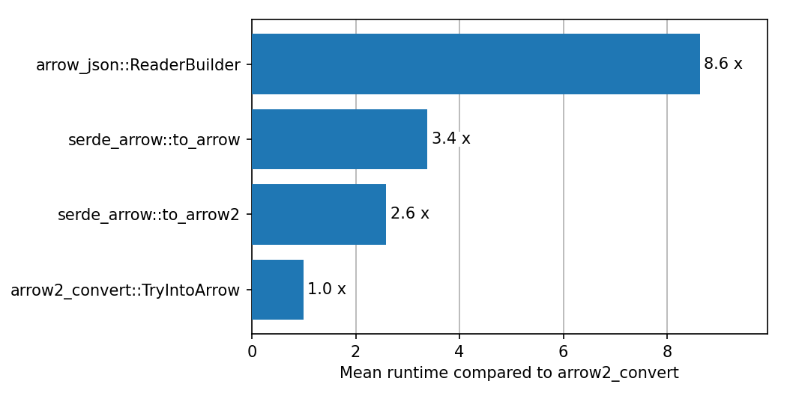

# `serde_arrow` - convert sequences of Rust objects to Arrow arrays and back again

[Crate info](https://crates.io/crates/serde_arrow)
| [API docs](https://docs.rs/serde_arrow/latest/serde_arrow/)
| [Example](#example)
| [Related packages & performance](#related-packages--performance)
| [Status](serde_arrow/Status.md)
| [License](#license)
| [Changes](Changes.md)
| [Development](Development.md)

The arrow in-memory format is a powerful way to work with data frame like
structures. The surrounding ecosystem includes a rich set of libraries, ranging
from data frames such as [Polars][polars] to query engines such as
[DataFusion][datafusion]. However, the API of the underlying Rust crates can be
at times cumbersome to use due to the statically typed nature of Rust.

`serde_arrow`, offers a simple way to convert Rust objects into Arrow arrays and
back.  `serde_arrow` relies on the [Serde](https://serde.rs) package to
interpret Rust objects. Therefore, adding support for `serde_arrow` to custom
types is as easy as using Serde's derive macros.

In the Rust ecosystem there are two competing implementations of the arrow
in-memory format. `serde_arrow` supports both [`arrow`][arrow] and
[`arrow2`][arrow2] for schema tracing, serialization from Rust structs to
arrays, and deserialization from arrays to Rust structs.

[arrow]: https://docs.rs/arrow/latest/arrow/
[arrow2]: https://docs.rs/arrow2/latest/arrow2/
[polars]: https://github.com/pola-rs/polars
[datafusion]: https://github.com/apache/arrow-datafusion/

## Example

The following examples assume that `serde_arrow` is added to the `Cargo.toml`
file and its features are configured. `serde_arrow` supports different `arrow`
and `arrow2` versions. The relevant one can be selected by specifying the
correct feature (e.g., `arrow-51` to support `arrow=51`). See
[here][feature-docs] for more details.

[feature-docs]: https://docs.rs/serde_arrow/latest/serde_arrow/#features

The following examples use the following Rust structure and example records

```rust
#[derive(Serialize, Deserialize)]
struct Record {
    a: f32,
    b: i32,
}

let records = vec![
    Record { a: 1.0, b: 1 },
    Record { a: 2.0, b: 2 },
    Record { a: 3.0, b: 3 },
];
```

### Serialize to `arrow` `RecordBatch`

```rust
use arrow::datatypes::FieldRef;
use serde_arrow::schema::{SchemaLike, TracingOptions};

// Determine Arrow schema
let fields = Vec::<FieldRef>::from_type::<Record>(TracingOptions::default())?;

// Build a record batch
let batch = serde_arrow::to_record_batch(&fields, &records)?;
```

This `RecordBatch` can now be written to disk using [ArrowWriter] from the [parquet] crate.

[ArrowWriter]: https://docs.rs/parquet/latest/parquet/arrow/arrow_writer/struct.ArrowWriter.html
[parquet]: https://docs.rs/parquet/latest/parquet/


```rust
let file = File::create("example.pq");
let mut writer = ArrowWriter::try_new(file, batch.schema(), None)?;
writer.write(&batch)?;
writer.close()?;
```

### Serialize to `arrow2` arrays

```rust
use arrow2::datatypes::Field;
use serde_arrow::schema::{SchemaLike, TracingOptions};

let fields = Vec::<Field>::from_type::<Record>(TracingOptions::default())?;
let arrays = serde_arrow::to_arrow2(&fields, &records)?;
```

These arrays can now be written to disk using the helper method defined in the
[arrow2 guide][arrow2-guide]. For parquet:

```rust,ignore
use arrow2::{chunk::Chunk, datatypes::Schema};

// see https://jorgecarleitao.github.io/arrow2/io/parquet_write.html
write_chunk(
    "example.pq",
    Schema::from(fields),
    Chunk::new(arrays),
)?;
```

### Usage from python

The written files can be read in Python via

```python
# using polars
>>> import polars as pl
>>> pl.read_parquet("example.pq")
shape: (3, 2)
┌─────┬─────┐
│ a   ┆ b   │
│ --- ┆ --- │
│ f32 ┆ i32 │
╞═════╪═════╡
│ 1.0 ┆ 1   │
│ 2.0 ┆ 2   │
│ 3.0 ┆ 3   │
└─────┴─────┘

# using pandas
>>> import pandas as pd
>>> pd.read_parquet("example.pq")
     a  b
0  1.0  1
1  2.0  2
2  3.0  3
```

[arrow2-guide]: https://jorgecarleitao.github.io/arrow2

## Related packages & Performance

- [`arrow`][arrow]: the JSON component of the official Arrow package supports
   serializing objects that support serialize via the [Decoder][serde-decoder]
   object. It supports primitives types, structs and lists
- [`arrow2-convert`][arrow2-convert]: adds derive macros to convert objects from
  and to arrow2 arrays. It supports primitive types, structs, lists, and
  chrono's date time types. Enum support is experimental according to the
  Readme. If performance is the main objective, `arrow2-convert` is a good
  choice as it has no or minimal overhead over building the arrays manually.

[serde-decoder]: https://docs.rs/arrow-json/latest/arrow_json/reader/struct.Decoder.html
[arrow2-convert]: https://github.com/DataEngineeringLabs/arrow2-convert

The different implementation have the following performance differences, when
compared to arrow2-convert:



The detailed runtimes of the [benchmarks](./serde_arrow/benches/groups/) are listed below.

<!-- start:benchmarks -->
### complex_common_serialize(100000)

| label                        | time [ms] | arrow2_convert: | serde_arrow::to | serde_arrow::to | arrow_json::Rea |
|------------------------------|-----------|-----------------|-----------------|-----------------|-----------------|
| arrow2_convert::TryIntoArrow |     54.01 |            1.00 |            0.31 |            0.30 |            0.14 |
| serde_arrow::to_arrow2       |    173.84 |            3.22 |            1.00 |            0.98 |            0.46 |
| serde_arrow::to_arrow        |    177.92 |            3.29 |            1.02 |            1.00 |            0.47 |
| arrow_json::ReaderBuilder    |    378.48 |            7.01 |            2.18 |            2.13 |            1.00 |

### complex_common_serialize(1000000)

| label                        | time [ms] | arrow2_convert: | serde_arrow::to | serde_arrow::to | arrow_json::Rea |
|------------------------------|-----------|-----------------|-----------------|-----------------|-----------------|
| arrow2_convert::TryIntoArrow |    576.81 |            1.00 |            0.34 |            0.33 |            0.16 |
| serde_arrow::to_arrow2       |   1701.46 |            2.95 |            1.00 |            0.97 |            0.46 |
| serde_arrow::to_arrow        |   1748.89 |            3.03 |            1.03 |            1.00 |            0.48 |
| arrow_json::ReaderBuilder    |   3676.51 |            6.37 |            2.16 |            2.10 |            1.00 |

### primitives_serialize(100000)

| label                        | time [ms] | arrow2_convert: | serde_arrow::to | serde_arrow::to | arrow_json::Rea |
|------------------------------|-----------|-----------------|-----------------|-----------------|-----------------|
| arrow2_convert::TryIntoArrow |     15.83 |            1.00 |            0.51 |            0.36 |            0.12 |
| serde_arrow::to_arrow2       |     30.90 |            1.95 |            1.00 |            0.70 |            0.23 |
| serde_arrow::to_arrow        |     43.96 |            2.78 |            1.42 |            1.00 |            0.33 |
| arrow_json::ReaderBuilder    |    133.97 |            8.46 |            4.34 |            3.05 |            1.00 |

### primitives_serialize(1000000)

| label                        | time [ms] | arrow2_convert: | serde_arrow::to | serde_arrow::to | arrow_json::Rea |
|------------------------------|-----------|-----------------|-----------------|-----------------|-----------------|
| arrow2_convert::TryIntoArrow |    153.07 |            1.00 |            0.47 |            0.35 |            0.11 |
| serde_arrow::to_arrow2       |    327.32 |            2.14 |            1.00 |            0.74 |            0.23 |
| serde_arrow::to_arrow        |    440.39 |            2.88 |            1.35 |            1.00 |            0.31 |
| arrow_json::ReaderBuilder    |   1429.31 |            9.34 |            4.37 |            3.25 |            1.00 |

<!-- end:benchmarks -->

## License

```text
Copyright (c) 2021 - 2024 Christopher Prohm and contributors

Permission is hereby granted, free of charge, to any person obtaining a copy
of this software and associated documentation files (the "Software"), to deal
in the Software without restriction, including without limitation the rights
to use, copy, modify, merge, publish, distribute, sublicense, and/or sell
copies of the Software, and to permit persons to whom the Software is
furnished to do so, subject to the following conditions:

The above copyright notice and this permission notice shall be included in all
copies or substantial portions of the Software.

THE SOFTWARE IS PROVIDED "AS IS", WITHOUT WARRANTY OF ANY KIND, EXPRESS OR
IMPLIED, INCLUDING BUT NOT LIMITED TO THE WARRANTIES OF MERCHANTABILITY,
FITNESS FOR A PARTICULAR PURPOSE AND NONINFRINGEMENT. IN NO EVENT SHALL THE
AUTHORS OR COPYRIGHT HOLDERS BE LIABLE FOR ANY CLAIM, DAMAGES OR OTHER
LIABILITY, WHETHER IN AN ACTION OF CONTRACT, TORT OR OTHERWISE, ARISING FROM,
OUT OF OR IN CONNECTION WITH THE SOFTWARE OR THE USE OR OTHER DEALINGS IN THE
SOFTWARE.
```
