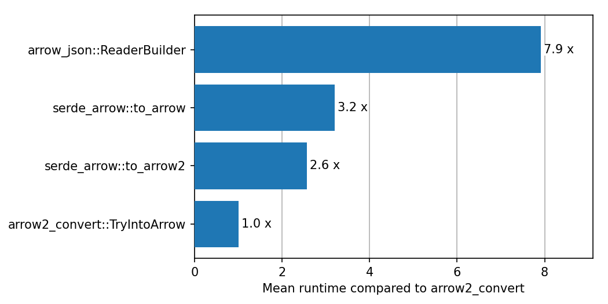

# `serde_arrow` - convert sequences of structs / maps to and from arrow arrays

[[Crate info]](https://crates.io/crates/serde_arrow)
| [[API docs]](https://docs.rs/serde_arrow/latest/serde_arrow/)
| [Changes](Changes.md)
| [Example](#example)
| [Related packages & performance](#related-packages--performance)
| [How does it work?](serde_arrow/Implementation.md)
| [Status](serde_arrow/Status.md)
| [Development](#development)
| [License](#license)

**Warning:** this package is in an experiment at the moment.

The arrow in-memory format is a powerful way to work with data frame like
structures. The surrounding ecosystem includes a rich set of libraries, ranging
from data frames via [Polars][polars] to query engines via
[DataFusion][datafusion]. However, the API of the underlying Rust crates can be
at times cumbersome to use due to the statically typed nature of Rust.

`serde_arrow`, offers a simple way to convert Rust objects into Arrow arrays and
back.  `serde_arrow` relies on the [Serde](https://serde.rs) package to
interpret Rust objects. Therefore, adding support for `serde_arrow` to custom
types is as easy as using Serde's derive macros.

In the Rust ecosystem there are two competing implemenetations of the arrow
in-memory format: [`arrow`][arrow] and [`arrow2`][arrow2]. `serde_arrow`
supports both for schema tracing and serialization from Rust structs to arrays.
Deserialization from arrays to Rust structs is currently only implemented for
`arrow2`.

[arrow]: https://docs.rs/arrow/latest/arrow/
[arrow2]: https://docs.rs/arrow2/latest/arrow2/
[polars]: https://github.com/pola-rs/polars
[datafusion]: https://github.com/apache/arrow-datafusion/

## Example

```rust
#[derive(Serialize)]
struct Item {
    a: f32,
    b: i32,
    point: Point,
}

#[derive(Serialize)]
struct Point(f32, f32);

let items = vec![
    Item { a: 1.0, b: 1, point: Point(0.0, 1.0) },
    Item { a: 2.0, b: 2, point: Point(2.0, 3.0) },
    // ...
];

// detect the field types and convert the items to arrays
use serde_arrow::arrow2::{serialize_into_fields, serialize_into_arrays};

let fields = serialize_into_fields(&items, TracingOptions::default())?;
let arrays = serialize_into_arrays(&fields, &items)?;
```

These arrays can now be written to disk using the helper method defined in the
[arrow2 guide][arrow2-guide]. For parquet:

```rust,ignore
use arrow2::{chunk::Chunk, datatypes::Schema};

// see https://jorgecarleitao.github.io/arrow2/io/parquet_write.html
write_chunk(
    "example.pq",
    Schema::from(fields),
    Chunk::new(arrays),
)?;
```

The written file can now be read in Python via

```python
# using polars
import polars as pl
pl.read_parquet("example.pq")

# using pandas
import pandas as pd
pd.read_parquet("example.pq")
```

[arrow2-guide]: https://jorgecarleitao.github.io/arrow2

## Related packages & Performance

- [`arrow`][arrow]: the JSON component of the official Arrow package supports
   serializing objects that support serialize via the [RawDecoder][raw-decoder]
   object. It supports primitives types, structs and lists
- [`arrow2-convert`][arrow2-convert]: adds derive macros to convert objects from
  and to arrow2 arrays. It supports primitive types, structs, lists, and
  chrono's date time types. Enum support is experimental according to the
  Readme. If performance is the main objective, `arrow2-convert` is a good
  choice as it has no or minimal overhead over building the arrays manually.

[raw-decoder]: https://docs.rs/arrow-json/37.0.0/arrow_json/struct.RawDecoder.html#method.serialize
[arrow2-convert]: https://github.com/DataEngineeringLabs/arrow2-convert

The different implementation have the following performance differences, when
compared to arrow2-convert:



The detailed runtimes of the [benchmarks](./serde_arrow/benches/groups/) are listed below.

<!-- start:benchmarks -->
###  complex_common_serialize(100000)

| label                | time [ms] | arrow2_convert | serde_arrow_byt | serde_arrow | arrow |
|----------------------|-----------|----------------|-----------------|-------------|-------|
| arrow2_convert       |     48.16 |           1.00 |            0.33 |        0.08 |  0.06 |
| serde_arrow_bytecode |    147.66 |           3.07 |            1.00 |        0.25 |  0.18 |
| serde_arrow          |    592.16 |          12.30 |            4.01 |        1.00 |  0.73 |
| arrow                |    815.95 |          16.94 |            5.53 |        1.38 |  1.00 |

###  complex_common_serialize(1000000)

| label                | time [ms] | arrow2_convert | serde_arrow_byt | serde_arrow | arrow |
|----------------------|-----------|----------------|-----------------|-------------|-------|
| arrow2_convert       |    464.95 |           1.00 |            0.32 |        0.08 |  0.06 |
| serde_arrow_bytecode |   1450.16 |           3.12 |            1.00 |        0.25 |  0.18 |
| serde_arrow          |   5784.91 |          12.44 |            3.99 |        1.00 |  0.71 |
| arrow                |   8144.66 |          17.52 |            5.62 |        1.41 |  1.00 |

###  primitives_serialize(100000)

| label                | time [ms] | arrow2_convert | serde_arrow_byt | serde_arrow | arrow |
|----------------------|-----------|----------------|-----------------|-------------|-------|
| arrow2_convert       |     14.26 |           1.00 |            0.32 |        0.26 |  0.07 |
| serde_arrow_bytecode |     45.04 |           3.16 |            1.00 |        0.81 |  0.24 |
| serde_arrow          |     55.86 |           3.92 |            1.24 |        1.00 |  0.29 |
| arrow                |    191.31 |          13.42 |            4.25 |        3.42 |  1.00 |

###  primitives_serialize(1000000)

| label                | time [ms] | arrow2_convert | serde_arrow_byt | serde_arrow | arrow |
|----------------------|-----------|----------------|-----------------|-------------|-------|
| arrow2_convert       |    149.41 |           1.00 |            0.33 |        0.27 |  0.08 |
| serde_arrow_bytecode |    451.34 |           3.02 |            1.00 |        0.82 |  0.23 |
| serde_arrow          |    549.38 |           3.68 |            1.22 |        1.00 |  0.28 |
| arrow                |   1957.01 |          13.10 |            4.34 |        3.56 |  1.00 |


<!-- end:benchmarks -->

## Development

All common tasks are bundled in the `x.py` script:

```bash
# format the code and run tests
python x.py precommit
```

Run `python x.py --help` for details. The script only uses standard Python
modules can can be run without installing further packages.

## License

```text
Copyright (c) 2021 - 2023 Christopher Prohm

Permission is hereby granted, free of charge, to any person obtaining a copy
of this software and associated documentation files (the "Software"), to deal
in the Software without restriction, including without limitation the rights
to use, copy, modify, merge, publish, distribute, sublicense, and/or sell
copies of the Software, and to permit persons to whom the Software is
furnished to do so, subject to the following conditions:

The above copyright notice and this permission notice shall be included in all
copies or substantial portions of the Software.

THE SOFTWARE IS PROVIDED "AS IS", WITHOUT WARRANTY OF ANY KIND, EXPRESS OR
IMPLIED, INCLUDING BUT NOT LIMITED TO THE WARRANTIES OF MERCHANTABILITY,
FITNESS FOR A PARTICULAR PURPOSE AND NONINFRINGEMENT. IN NO EVENT SHALL THE
AUTHORS OR COPYRIGHT HOLDERS BE LIABLE FOR ANY CLAIM, DAMAGES OR OTHER
LIABILITY, WHETHER IN AN ACTION OF CONTRACT, TORT OR OTHERWISE, ARISING FROM,
OUT OF OR IN CONNECTION WITH THE SOFTWARE OR THE USE OR OTHER DEALINGS IN THE
SOFTWARE.
```
